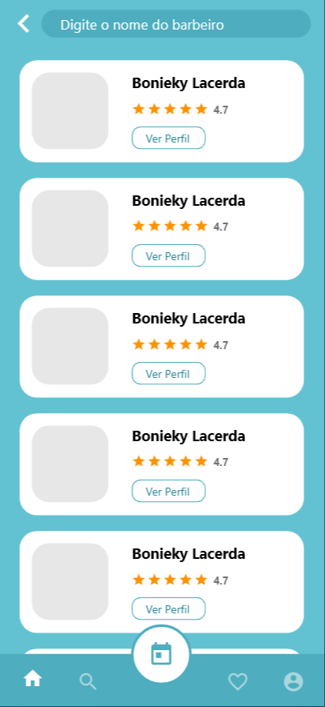

<h1 align="center">:scissors: Devsbarber API :scissors:</h1>

O Devsbarber API se trata de uma API desenvolvida em laravel para ser utilizado no app mobile DevBarber, o mesmo se trata de um sistema de agendamento para barbeiros utilizando Geo Localização do Google, digamos que seria o ifood dos barbeiros HAHA.

## :camera: Demonstração

  
    
  
    
  
  

 

# Funcionalidades

 - 1 - Unauthorized
 - 2 - Cadastro
 - 3 - Login
 - 4 - Logout
 - 5 - Refresh token JWT
 - 6 - Listar Infomaçãoes do usuario logado
 - 7 - Listar Barbeiros favoritos
 - 8 - Favoritar Barbeiro
 - 9 - Listar Agendamentos do usuario
 - 10 - Listar todo os barbeiros
 - 11 - Listar barbeiro pelo ID
 - 12 - Fazer agendamento com o barbeiro
 - 13 - Buscar barbeiro
 - 14 - Atualizar informações do perfil do usuario
 - 15 - Atualizar Avatar do Usuario

# Rotas

 - 1 - /401 - GET
 - 2 - /auth/login - POST
 - 3 - /user - POST
 - 4 - /auth/logout - POST
 - 5 - /auth/refresh - POST
 - 6 - /user - GET
 - 7 - /user/favorites - GET
 - 8 - /user/favorite - POST
 - 9 - /user/appointments - GET
 - 10 - /barbers - GET
 - 11 - /barber/{id} - GET
 - 12 - /barbers/{id}/appointment - POST
 - 13 - /search - GET
 - 14 - /user -PUT
 - 15 - /user/avatar - POST

---

## 🚀 Tecnologias

Este projeto foi desenvolvido com as seguintes tecnologias:

- ✔️ Laravel

- ✔️ JWT

- ✔️ Routes

- ✔️ Storage

- ✔️ Middlewares

- ✔️ Api Geo localização do google

- ✔️ Intervention Image

- ✔️ Migrations

## ⚙ Configuração via Composer

1- Para instalar dependências do projeto:
> composer install

2- Para criar as tabelas:
> php artisan migrate

3- Iniciar o servidor
> php artisan serve

Feito com 💜 por RENAN CAVALCANTE 👋 [Veja meu Linkedin](https://www.linkedin.com/in/renanweb/)
 
